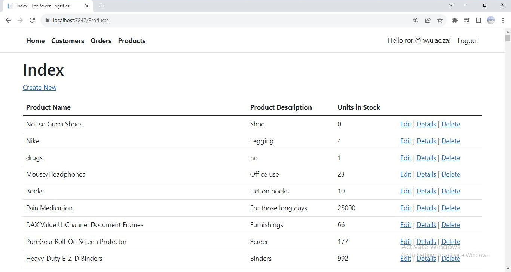

# EcoPower Logistics (CMPG323)
This project is an illustration of Inversion of the Control / Dependency Injection design pattern using the .NET Framework.

# Usage
This an MVC Web App that allows users to browse through and interact with the EcoPower Logistics system by reading and writing orders, products and so on.

# How to use
Register an account and log in
The following view will then be presented.
From here, you can perform respective CRUD operations on the data.

# Secret Keys
Appsetting contain sensitive info that has been ommited and pushed only to the Azure web service, where the codebase isn't publicly accessible.

# References
